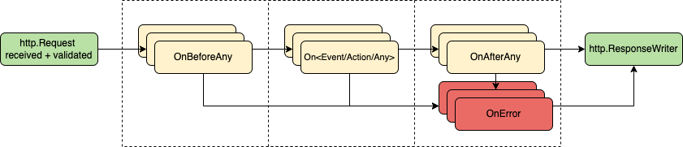

# githubevents


**[GitHub](https://github.com/) webhook events toolset for [Go](https://go.dev/)**

[](https://github.com/cbrgm/githubevents/releases)
[](https://goreportcard.com/report/github.com/cbrgm/githubevents)
[](https://pkg.go.dev/github.com/cbrgm/githubevents/githubevents)
[](https://pkg.go.dev/github.com/cbrgm/githubevents/githubevents)
[](https://github.com/cbrgm/githubevents/blob/master/LICENSE)


`githubevents` is a webhook events toolset for the Go programming language inspired by ***[octokit/webhooks.js](https://github.com/octokit/webhooks.js)***.

This library makes use of [google/go-github](https://github.com/google/go-github) and provides functionality to register callbacks for Github events and their actions, so that you can easily execute your own logic in response to webhook events.

---

* [Usage](#usage)
* [API](#api)
  + [Constructor](#constructor)
  + [Callbacks](#callbacks)
  + [OnBeforeAny](#onbeforeany)
  + [OnAfterAny](#onafterany)
  + [OnError](#onerror)
* [Supported Webhooks Events](#supported-webhooks-events)
* [Local Development](#local-development)
* [Compatibility](#compatibility)
* [Contributing & License](#contributing---license)

## Usage

```go
import (
    "github.com/cbrgm/githubevents/githubevents"
)
```

Create a new `githubevents.EventHandler`, register callbacks and start a http server.

```go
package main

import (
  "fmt"
  "github.com/cbrgm/githubevents/githubevents"
  "github.com/google/go-github/v56/github"
  "net/http"
)

func main() {
    // create a new event handler
    handle := githubevents.New("secretkey")

    // add callbacks
    handle.OnIssueCommentCreated(
      func(deliveryID string, eventName string, event *github.IssueCommentEvent) error {
          fmt.Printf("%s made a comment!", event.Sender.Login)
          return nil
      },
    )

    // add a http handleFunc
    http.HandleFunc("/hook", func(w http.ResponseWriter, r *http.Request) {
        err := handle.HandleEventRequest(r)
        if err != nil {
            fmt.Println("error")
        }
    })

    // start the server listening on port 8080
    if err := http.ListenAndServe(":8080", nil); err != nil {
        panic(err)
    }
}
```

For more usage examples, please have a look at the [examples](https://github.com/cbrgm/githubevents/tree/main/examples) directory.

## API

Please refer to [pkg.go.dev](https://pkg.go.dev/github.com/cbrgm/githubevents/githubevents) for a full list of supported callback functions.

### Constructor

To create a new `githubevents.EventHandler` use the following constructor:

```go
handle := githubevents.New("secretkey")
// ...
```

`secretkey` is the GitHub Webhook secret token. If your webhook does not contain a secret token, you can set `nil`.
This is intended for local development purposes only and all webhooks should ideally set up a secret token.

### Callbacks

Functions to register callbacks follow a specific naming scheme. `On...` functions register one or more callbacks and add them to previously registered ones.

`SetOn...` functions also register callbacks, but override previously registered ones.

`On...Any`/`SetOn...Any` functions register callbacks that are executed on each action of an event (if the event has actions).

A full list of supported events for this Go module can be found under the section "[Supported Webhooks Events](#supported-webhooks-events)". A full documentation including all functions to register callbacks can be found on [pkg.go.dev](https://pkg.go.dev/github.com/cbrgm/githubevents/githubevents).

#### Callback Execution Order



Each callback in a registered group is executed in parallel. Each group blocks until all callbacks executed in parallel have returned,
then returns the first non-nil error (if any) from them. If `OnError` callbacks have been set, they will be called when an error occurs.
The order of execution is open for discussion, contributions are welcome!

### OnBeforeAny

`OnBeforeAny` registers callbacks which are triggered before any event. Registered callbacks are executed in parallel in separate Goroutines.

```go
handle := githubevents.New("secretkey")
handle.OnBeforeAny(
    func(deliveryID string, eventName string, event interface{}) error {
        fmt.Printf("%s event received!", eventName)
        // do something
        return nil
    },
)
// ...
```

### OnAfterAny

`OnAfterAny` registers callbacks which are triggered after any event. Registered callbacks are executed in parallel in separate Goroutines.

```go
handle := githubevents.New("secretkey")
handle.OnAfterAny(
    func(deliveryID string, eventName string, event interface{}) error {
        fmt.Printf("%s event received!", eventName)
        // do something
        return nil
    },
)
// ...
```

### OnError

`OnError` registers callbacks which are triggered whenever an error occurs. These callbacks can be used for additional error handling, debugging or logging purposes. Registered callbacks are executed in parallel in separate Goroutines.

```go
handle := githubevents.New("secretkey")
handle.OnError(
	func(deliveryID string, eventName string, event interface{}, err error) error {
		fmt.Printf("received error %s", err)
		// additional error handling ...
		return err
	},
)
// ...
```

## Supported Webhooks Events


* ***[branch_protection_rule](https://docs.github.com/en/developers/webhooks-and-events/webhooks/webhook-events-and-payloads#branch_protection_rule)***

* ***[check_run](https://docs.github.com/en/developers/webhooks-and-events/webhooks/webhook-events-and-payloads#check_run)***

* ***[check_suite](https://docs.github.com/en/developers/webhooks-and-events/webhooks/webhook-events-and-payloads#check_suite)***

* ***[commit_comment](https://docs.github.com/en/developers/webhooks-and-events/webhooks/webhook-events-and-payloads#commit_comment)***

* ***[create](https://docs.github.com/en/developers/webhooks-and-events/webhooks/webhook-events-and-payloads#create)***

* ***[delete](https://docs.github.com/en/developers/webhooks-and-events/webhooks/webhook-events-and-payloads#delete)***

* ***[deploy_key](https://docs.github.com/en/developers/webhooks-and-events/webhooks/webhook-events-and-payloads#deploy_key)***

* ***[deployment](https://docs.github.com/en/developers/webhooks-and-events/webhooks/webhook-events-and-payloads#deployment)***

* ***[deployment_status](https://docs.github.com/en/developers/webhooks-and-events/webhooks/webhook-events-and-payloads#deployment_status)***

* ***[discussion](https://docs.github.com/en/developers/webhooks-and-events/webhooks/webhook-events-and-payloads#discussion)***

* ***[fork](https://docs.github.com/en/developers/webhooks-and-events/webhooks/webhook-events-and-payloads#fork)***

* ***[github_app_authorization](https://docs.github.com/en/developers/webhooks-and-events/webhooks/webhook-events-and-payloads#github_app_authorization)***

* ***[gollum](https://docs.github.com/en/developers/webhooks-and-events/webhooks/webhook-events-and-payloads#gollum)***

* ***[installation](https://docs.github.com/en/developers/webhooks-and-events/webhooks/webhook-events-and-payloads#installation)***

* ***[installation_repositories](https://docs.github.com/en/developers/webhooks-and-events/webhooks/webhook-events-and-payloads#installation_repositories)***

* ***[issue_comment](https://docs.github.com/en/developers/webhooks-and-events/webhooks/webhook-events-and-payloads#issue_comment)***

* ***[issues](https://docs.github.com/en/developers/webhooks-and-events/webhooks/webhook-events-and-payloads#issues)***

* ***[label](https://docs.github.com/en/developers/webhooks-and-events/webhooks/webhook-events-and-payloads#label)***

* ***[marketplace_purchase](https://docs.github.com/en/developers/webhooks-and-events/webhooks/webhook-events-and-payloads#marketplace_purchase)***

* ***[member](https://docs.github.com/en/developers/webhooks-and-events/webhooks/webhook-events-and-payloads#member)***

* ***[membership](https://docs.github.com/en/developers/webhooks-and-events/webhooks/webhook-events-and-payloads#membership)***

* ***[meta](https://docs.github.com/en/developers/webhooks-and-events/webhooks/webhook-events-and-payloads#meta)***

* ***[milestone](https://docs.github.com/en/developers/webhooks-and-events/webhooks/webhook-events-and-payloads#milestone)***

* ***[organization](https://docs.github.com/en/developers/webhooks-and-events/webhooks/webhook-events-and-payloads#organization)***

* ***[org_block](https://docs.github.com/en/developers/webhooks-and-events/webhooks/webhook-events-and-payloads#org_block)***

* ***[package](https://docs.github.com/en/developers/webhooks-and-events/webhooks/webhook-events-and-payloads#package)***

* ***[page_build](https://docs.github.com/en/developers/webhooks-and-events/webhooks/webhook-events-and-payloads#page_build)***

* ***[ping](https://docs.github.com/en/developers/webhooks-and-events/webhooks/webhook-events-and-payloads#ping)***

* ***[project](https://docs.github.com/en/developers/webhooks-and-events/webhooks/webhook-events-and-payloads#project)***

* ***[project_card](https://docs.github.com/en/developers/webhooks-and-events/webhooks/webhook-events-and-payloads#project_card)***

* ***[project_column](https://docs.github.com/en/developers/webhooks-and-events/webhooks/webhook-events-and-payloads#project_column)***

* ***[public](https://docs.github.com/en/developers/webhooks-and-events/webhooks/webhook-events-and-payloads#public)***

* ***[pull_request](https://docs.github.com/en/developers/webhooks-and-events/webhooks/webhook-events-and-payloads#pull_request)***

* ***[pull_request_review](https://docs.github.com/en/developers/webhooks-and-events/webhooks/webhook-events-and-payloads#pull_request_review)***

* ***[pull_request_review_comment](https://docs.github.com/en/developers/webhooks-and-events/webhooks/webhook-events-and-payloads#pull_request_review_comment)***

* ***[push](https://docs.github.com/en/developers/webhooks-and-events/webhooks/webhook-events-and-payloads#push)***

* ***[release](https://docs.github.com/en/developers/webhooks-and-events/webhooks/webhook-events-and-payloads#release)***

* ***[repository_dispatch](https://docs.github.com/en/developers/webhooks-and-events/webhooks/webhook-events-and-payloads#repository_dispatch)***

* ***[repository](https://docs.github.com/en/developers/webhooks-and-events/webhooks/webhook-events-and-payloads#repository)***

* ***[repository_vulnerability_alert](https://docs.github.com/en/developers/webhooks-and-events/webhooks/webhook-events-and-payloads#repository_vulnerability_alert)***

* ***[star](https://docs.github.com/en/developers/webhooks-and-events/webhooks/webhook-events-and-payloads#star)***

* ***[status](https://docs.github.com/en/developers/webhooks-and-events/webhooks/webhook-events-and-payloads#status)***

* ***[team](https://docs.github.com/en/developers/webhooks-and-events/webhooks/webhook-events-and-payloads#team)***

* ***[team_add](https://docs.github.com/en/developers/webhooks-and-events/webhooks/webhook-events-and-payloads#team_add)***

* ***[watch](https://docs.github.com/en/developers/webhooks-and-events/webhooks/webhook-events-and-payloads#watch)***

* ***[workflow_job](https://docs.github.com/en/developers/webhooks-and-events/webhooks/webhook-events-and-payloads#workflow_job)***

* ***[workflow_dispatch](https://docs.github.com/en/developers/webhooks-and-events/webhooks/webhook-events-and-payloads#workflow_dispatch)***

* ***[workflow_run](https://docs.github.com/en/developers/webhooks-and-events/webhooks/webhook-events-and-payloads#workflow_run)***

## Local development

All Go code in `githubevents` is generated via the make target `make generate` (Go 1.18+ required).
Changes must be done in `gen/generate.go`. To add new events, add a corresponding entry to `gen/template_params.go`.

To validate the generated go code run `go run examples/simple-http-server` and make changes to test your functions.

You can use services like [ngrok](https://ngrok.com/) to expose your local port `8080` to the world.
Enter the public domain name as the webhook endpoint. You can install webhooks on an organization or on a specific repository.
To set up a webhook, go to the settings page of your repository or organization. From there, click Webhooks, then Add webhook.
Alternatively, you can choose to build and manage a webhook through the Webhooks API.

## Compatibility

| google/go-github | cbrgm/githubevents |
|------------------|--------------------|
| `v56.x`            | `v1.9.x`   |
| `v50.x`            | `v1.8.x`   |
| `v49.x`            | <= `v1.7.x`   |
| `v48.x`            | <=`v1.6.x`   |
| `v47.x`            | <=`v1.4.x`   |
| `v46.x`            | <=`v1.3.x`   |
| `v45.x`            | <=`v1.2.x`   |
| `v44.x`            | <=`v1.1.2x`   |
| `v43.x`            | <=`v1.1.1x`   |

## Contributing & License

Feel free to submit changes! See
the [Contributing Guide](https://github.com/cbrgm/contributing/blob/master/CONTRIBUTING.md). This project is open-source
and is developed under the terms of the [MIT License](https://github.com/cbrgm/githubevents/blob/master/LICENSE).
